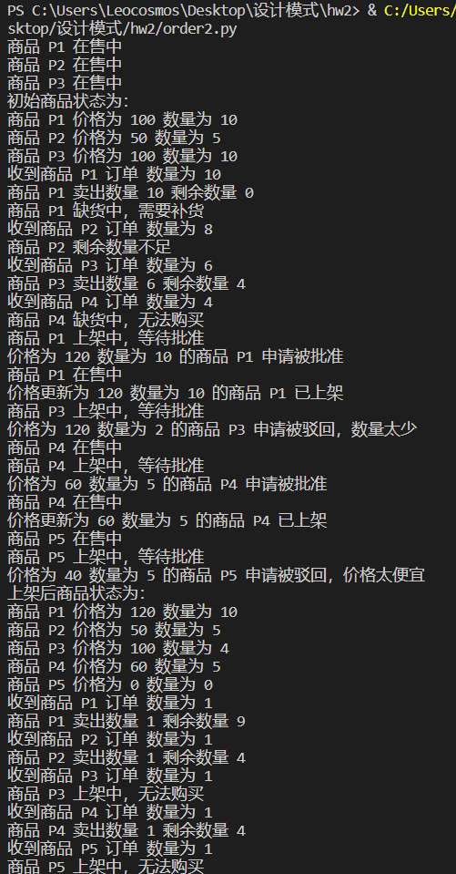

# 订单结算模块设计：
## 1. 方案设计：
采用策略模式设计模块，CashSuper为父类定义抽象方法，CashNormal、CashRebate和CashReturn为子类实现具体方法，CashContext为上下文类维护策略对象，通过接收type结算类型参数指定具体子类进行实例化
## 2.代码实现及截图：
```python
from collections import defaultdict

class CashSuper():
    def __init__(self):
        pass
    def acceptCash(self, money):
        pass

class CashNormal(CashSuper):
    def __init__(self):
        pass
    def acceptCash(self, money):
        return money

class CashRebate(CashSuper):
    def __init__(self, rebate):
        self.rebate = rebate
    def acceptCash(self, money):
        return money * self.rebate

class CashReturn(CashSuper):
    def __init__(self, con, ret):
        self.con = con
        self.ret = ret
    def acceptCash(self, money):
        return money - money // self.con * self.ret

class CashContext():
    def __init__(self, type):
        self.cs = CashSuper()
        if type == 'Normal':
            self.cs = CashNormal()
        elif type == 'Rebate':
            self.cs = CashRebate(0.8)
        elif type == 'Return':
            self.cs = CashReturn(300, 100)
    def getResult(self, money):
        return self.cs.acceptCash(money)

if __name__ == '__main__':
    orders = [(100, 10, 'Normal'), (50, 5, 'Normal'), 
              (100, 10, 'Rebate'), (50, 5, 'Rebate'), 
              (100, 10, 'Return'), (50, 5, 'Return')]
    prices = defaultdict(int)
    for price, count, type in orders:
        cc = CashContext(type)
        prices[type] += cc.getResult(price * count)
    for k, v in prices.items():
        print("The price of type %s" % k + " is %d" % v)
    print("The total price of order is %d" % sum(prices.values()))
```

## 3.采用理由：
定义一个算法家族，使得家族内的不同算法都遵从算法家族的接口及方法规范，从而可以实现算法间互相替换，且不会影响到使用算法的客户
  